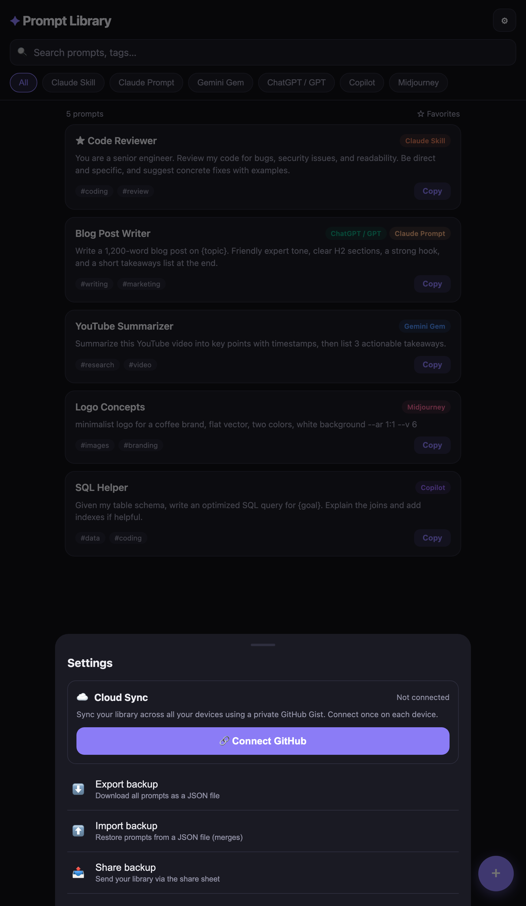

# Prompt Library

A phone-friendly app to store, organize, and copy all your AI prompts and skills in one place — Claude Skills, Gemini Gems, ChatGPT/GPT prompts, Copilot, Midjourney, Perplexity, and any custom tool.

It's a single HTML file. **Host your own copy** on free GitHub Pages, under your own GitHub account, with your prompts stored in your own private database. No servers, no third-party accounts, no tracking.

<p align="center">
  
</p>

---

## Features

- **Multi-tool tagging** — one prompt can belong to several tools at once.
- **Search & filters** — search titles, content, and tags; filter by tool.
- **Favorites** — star your most-used prompts to sort them to the top.
- **One-tap copy** — copy any prompt straight to your clipboard.
- **File upload + auto-analyze** — drop in a `SKILL.md`, `.txt`, `.json`, or a zipped Claude `.skill` and it auto-fills the title, tool, tags, and notes.
- **Private cloud sync** — optional sync across devices using your own private GitHub Gist.
- **Export / Import / Share** — back up the whole library to a JSON file anytime.
- **Installable** — add it to your home screen; works offline.

---

## Host your own copy (free, ~5 minutes)

You host it yourself, on your own GitHub account. Your deployment and your data are entirely yours.

**Prerequisites:** a free [GitHub account](https://github.com/signup) and the [GitHub CLI](https://cli.github.com/) (`gh`).

**1. Get the file.** Download `index.html` from this repo into a new folder on your computer.

**2. Sign in to GitHub from your terminal:**
```bash
gh auth login
# choose: GitHub.com  →  HTTPS  →  Login with a web browser
```

**3. Create your repo and push it:**
```bash
cd path/to/your-folder
git init
git add index.html
git commit -m "Prompt Library"
gh repo create prompt-library --public --source=. --push
```

**4. Turn on GitHub Pages** (replace `YOUR-USERNAME`):
```bash
gh api -X POST repos/YOUR-USERNAME/prompt-library/pages \
  -f "source[branch]=master" -f "source[path]=/"
```

Within about a minute your app is live at:

```
https://YOUR-USERNAME.github.io/prompt-library/
```

> The repo is public, but that only publishes the app's **code**. Your prompts are never in the code — see [Security & privacy](#security--privacy).

---

## Put it on your phone

1. Open your `https://YOUR-USERNAME.github.io/prompt-library/` URL in your phone's browser.
2. Install it to your home screen so it opens like a native app:
   - **iPhone (Safari):** Share → Add to Home Screen
   - **Android (Chrome):** Menu (⋮) → Add to Home screen
3. Tap **+** to add your first prompt.

Your prompts are saved in this device's browser. To use the same library on more than one device, turn on [Cloud sync](#cloud-sync-your-own-private-database).

---

## Using the app

- **Add a prompt:** tap **+**, give it a title, select one or more AI tools, paste the content, add tags/notes, Save.
- **Upload a file:** in the editor, tap **Upload a file**. Text files and Claude `.skill`/`.zip` packages are read and used to auto-fill the form; other files are kept as a downloadable attachment.
- **Find a prompt:** use the search bar, the tool filter chips, or the Favorites toggle.
- **Use a prompt:** tap **Copy** on a card, or open it for the full view with Copy, favorite, edit, and delete.

---

## Cloud sync (your own private database)

By default each device keeps its own library. Cloud sync keeps them all in sync using **your own private GitHub Gist** as the database — only you can read it. It reuses your existing GitHub account, so there's nothing new to sign up for.

<p align="center">
  
</p>

**Turn it on (on each device):**

1. Open the app → **Settings** (top-right) → **Connect GitHub**.
2. Tap **Create a token** — it opens GitHub with the correct `gist` permission pre-selected. Generate the token and copy it.
3. Paste the token into the app → **Connect**.

The first device creates a private gist; every other device you connect pulls the same library. After that, edits sync automatically, and you can force a sync anytime with **Sync now**. If the same prompt is edited on two devices, the newest edit wins.

> **Tip:** create a classic token with **only the `gist` scope** and a long (or no) expiration. You can revoke it anytime at github.com/settings/tokens.

---

## Run it locally

The app is a single `index.html` with no build step or dependencies.

```bash
# from the project folder
python3 -m http.server 8642
```

Then open `http://localhost:8642`. (Serving over http makes the clipboard and file-upload features work reliably.)

---

## Security & privacy

Your prompts are private. The hosting only ever exposes the app's code, never your data.

```
Public   →  your GitHub repo   →  index.html  (the app code only — no data, no tokens)
Private  →  your sync gist     →  your prompts (only your GitHub account can read it)
Local    →  your GitHub token  →  stays in each device's browser — never uploaded
```

- Anyone who opens your app URL sees an empty library — your prompts were never part of the published code.
- Prompts live in your browser's local storage and, if sync is on, in your private gist.
- Your token is stored only in your device's browser. It is never committed to the repo or its history.
- The only ways your prompts leave a device are deliberate actions you take: sharing an exported backup file, or connecting sync on another device.

---

## Backup & restore

In **Settings**:

- **Export backup** — download the whole library (including attachments) as a JSON file.
- **Import backup** — restore from a JSON file. It merges and keeps the newest version of each prompt, so it's safe to import onto a device that already has data.
- **Share backup** — send the backup through your device's share sheet.

This is also the simplest way to move prompts between devices without using cloud sync.

---

## Tech notes

- Single file, vanilla HTML/CSS/JavaScript — no framework, no build, no dependencies.
- Storage: browser local storage; optional sync via the GitHub Gists REST API called directly from the browser.
- Offline-capable once loaded; designed mobile-first.
