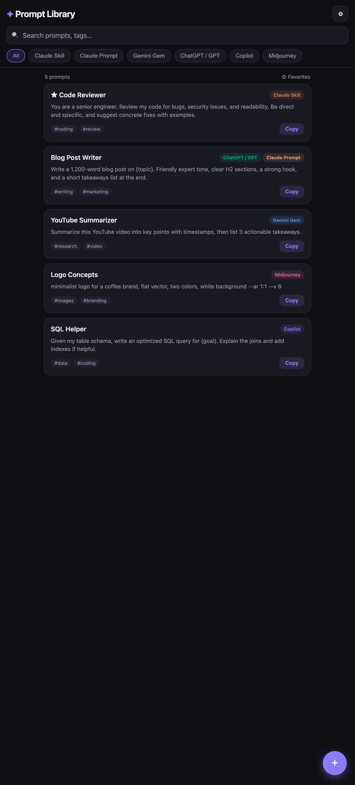
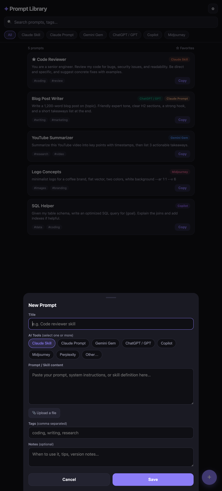
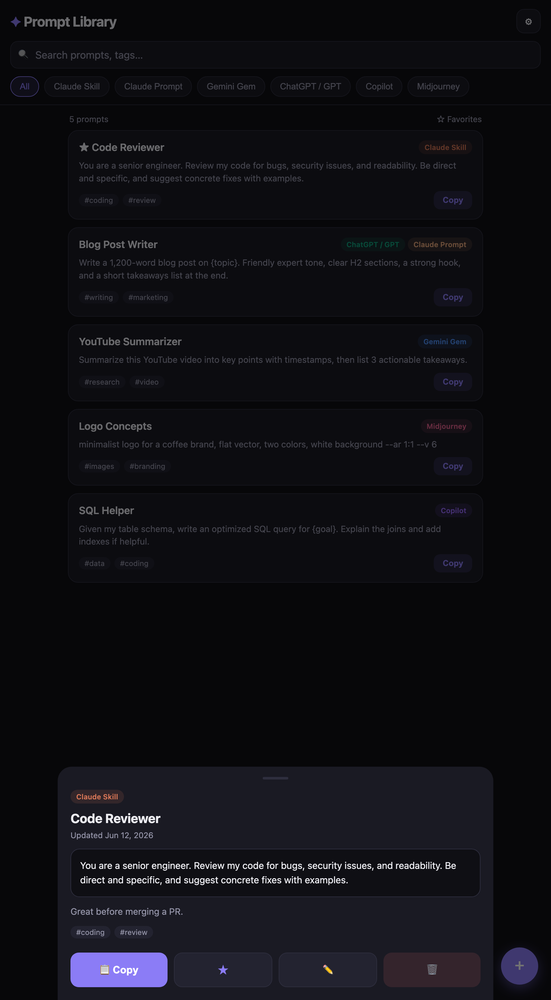
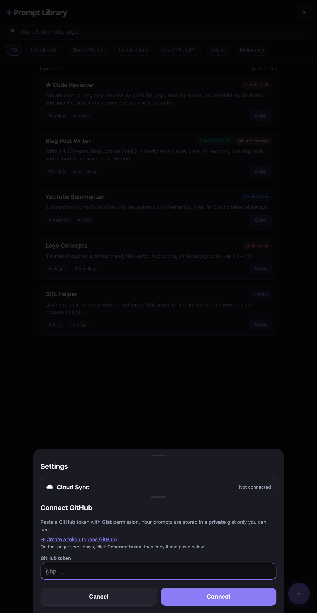

# ✦ Prompt Library

A phone-friendly app to store, organize, and copy all your AI prompts and skills in one place — **Claude Skills, Gemini Gems, ChatGPT/GPT prompts, Copilot, Midjourney, Perplexity**, and any custom tool you use.

No accounts, no servers, no tracking. Your prompts live on your device and (optionally) sync privately across all your devices through your own GitHub.

🔗 **Live app:** https://jihenbouguerra.github.io/prompt-library/

<p align="center">
  
  &nbsp;&nbsp;
  
  &nbsp;&nbsp;
  
</p>

---

## ✨ Features

- 🏷️ **Multi-tool tagging** — one prompt can belong to several tools at once (e.g. a prompt that works as both a Claude Skill *and* a Gemini Gem).
- 🔍 **Instant search & filters** — search titles, content, and tags; filter by tool with one tap.
- ⭐ **Favorites** — star the prompts you use most so they sort to the top.
- 📋 **One-tap copy** — copy any prompt straight to your clipboard, ready to paste.
- 📎 **File upload + auto-analyze** — drop in a `SKILL.md`, `.txt`, `.json`, or a zipped Claude `.skill`/`.zip` and the app reads it to **auto-fill** the title, tool, tags, and notes.
- ☁️ **Private cloud sync** — optional sync across devices via a **private GitHub Gist** (see [Cloud Sync](#-cloud-sync-use-the-same-library-everywhere)).
- 💾 **Export / Import / Share** — back up your whole library to a JSON file anytime.
- 📱 **Installable** — add it to your home screen and it behaves like a native app, working offline.

---

## 📱 Use it on your phone

**1.** Open the app in your phone's browser:

> https://jihenbouguerra.github.io/prompt-library/

**2.** Install it to your home screen so it opens like a real app:

| iPhone (Safari) | Android (Chrome) |
|---|---|
| Tap **Share** → **Add to Home Screen** | Tap **⋮** → **Add to Home screen** |

**3.** Tap the **+** button to add your first prompt. That's it — it works offline after the first load.

> 💡 Your prompts are saved on **this device's browser**. To use the same library on another device, turn on [Cloud Sync](#-cloud-sync-use-the-same-library-everywhere).

---

## 🧩 How to use the app

### Add a prompt
Tap the **+** button (bottom-right) and fill in:


- **Title** — a name you'll recognize
- **AI Tools** — tap one *or more* chips (multi-select)
- **Prompt / Skill content** — paste the prompt text
- **Upload a file** *(optional)* — see below
- **Tags** — comma-separated, e.g. `coding, writing`
- **Notes** *(optional)* — when/how to use it

Tap **Save**.

### Upload a file (auto-fills the form)
In the editor, tap **📎 Upload a file**:

- **Text files** (`.md`, `.txt`, `.json`, `.yaml`) → content loads in and the app reads it to auto-fill the title, tool, tags, and notes.
- **Claude skill packages** (`.zip` / `.skill`) → the app opens the package, finds `SKILL.md`, and fills the form from its frontmatter.
- **Other files** → stored as a downloadable attachment.

### Find & use a prompt
- **Search bar** — matches titles, content, and tags.
- **Filter chips** — tap a tool name to show only those prompts.
- **☆ Favorites** — show only starred prompts.
- Tap any card → full view with **Copy**, **★ favorite**, **✏️ edit**, **🗑 delete**.

---

## 💻 Run it locally

The whole app is a single `index.html` file — no build step, no dependencies.

**Option A — just open the file:**
```bash
open "index.html"
```

**Option B — serve it (recommended; clipboard & file features work best over http):**
```bash
# from the project folder
python3 -m http.server 8642
```
Then visit **http://localhost:8642** in your browser.

> Data saved at `localhost` is stored separately from the hosted version. Turn on Cloud Sync (below) or use Export/Import to move prompts between them.

---

## 🚀 Deploy your own copy (GitHub Pages — free)

You can host your own copy for free in a couple of minutes.

**1.** Make sure you have the [GitHub CLI](https://cli.github.com/) and are logged in:
```bash
gh auth login   # choose: GitHub.com → HTTPS → Login with a web browser
```

**2.** From the project folder, create the repo and push:
```bash
git init
git add index.html README.md screenshots
git commit -m "Prompt Library app"
gh repo create prompt-library --public --source=. --push
```

**3.** Turn on GitHub Pages:
```bash
gh api -X POST repos/<your-username>/prompt-library/pages \
  -f "source[branch]=master" -f "source[path]=/"
```

Your app goes live at `https://<your-username>.github.io/prompt-library/` within ~1 minute.

> The repo is **public**, but that only exposes the app's *code* — **never your prompts**. See [Security & Privacy](#-security--privacy).

---

## ☁️ Cloud Sync — use the same library everywhere

By default each device keeps its own library. Cloud Sync keeps them all in sync using a **private GitHub Gist** that only you can read. **No new account** — it reuses your existing GitHub.

<p align="center">
  
  &nbsp;&nbsp;
  
</p>

### Turn it on (do this on each device)

1. Open the app → tap **⚙️ (top-right)** → **🔗 Connect GitHub**.
2. Tap **→ Create a token** — it opens GitHub with the right setting pre-selected (the **`gist`** permission only). Scroll down → **Generate token** → **copy** it.
3. Paste the token into the app → tap **Connect**.

That's it. The first device creates a private gist; every other device you connect to pulls the same library.

### How it behaves afterward
| Action | Result |
|---|---|
| Add or edit a prompt | Auto-saves to the cloud a moment later |
| Open the app on another connected device | Pulls the latest automatically |
| **⚙️ → 🔄 Sync now** | Forces an immediate two-way sync |
| Same prompt edited on two devices | Newest edit wins — nothing is lost |

> 💡 **Tip:** When creating the token, choose a **classic token** with **only the `gist` scope** and a long (or no) expiration, so sync doesn't stop working unexpectedly.

---

## 🔒 Security & Privacy

**Your prompts are private. Nobody else can see them.**

```
PUBLIC   →  Your GitHub repo  →  index.html  (just the app's code — no data, no tokens)
PRIVATE  →  Your sync Gist    →  your actual prompts  (only your GitHub account can read it)
LOCAL    →  Your GitHub token →  lives only in each device's browser — never uploaded
```

- **The hosted app is empty for everyone else.** A stranger who opens your URL sees a blank library — your prompts were never part of the code.
- **Prompts live in your browser** (localStorage) and, if sync is on, in a **private Gist** tied to your GitHub account.
- **Your token never leaves your device** — it isn't in the code, the repo, or the git history.
- **The only ways your prompts could leave your device** are deliberate actions *you* take: sharing an exported backup file, or connecting sync on someone else's device.

**Hardening tips:**
- Give the sync token **only the `gist` scope** — nothing else in your account is reachable even if it leaks.
- You can revoke the token anytime at [github.com/settings/tokens](https://github.com/settings/tokens).

---

## 💾 Backup & restore

Tap **⚙️ (Settings)**:

- **⬇️ Export backup** — downloads your whole library (including attachments) as a JSON file.
- **⬆️ Import backup** — restores from a JSON file. It **merges** (keeps the newest version of each prompt), so it's safe to import onto a device that already has prompts.
- **📤 Share backup** — send the backup through your phone's share sheet.

This is also the simplest way to move prompts between devices if you'd rather not use Cloud Sync.

---

## 🛠️ Tech notes

- **Single file**, vanilla HTML/CSS/JavaScript — no framework, no build, no dependencies.
- **Storage:** browser `localStorage`; optional sync via the GitHub Gists REST API (called directly from the browser).
- **Offline-capable** once loaded; designed mobile-first.

---

*Built as a personal prompt manager. Your data is yours — keep a backup. 🙂*
